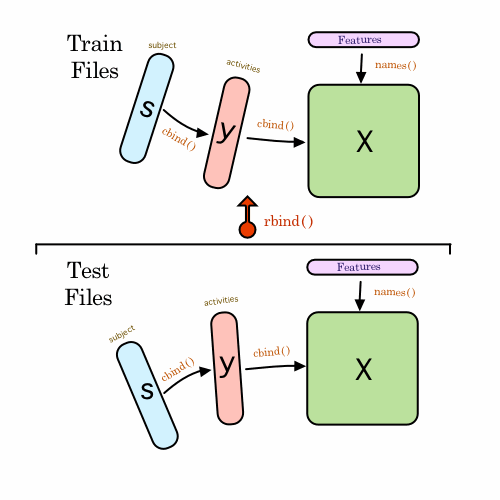

#CodeBook for the Getting and Cleaning Data course project.

##Index

1. Details of the Human Activity Recognition Using Smartphones Dataset
Version 1.0
2. The data files from the experiment
3. Details of the observations that were recorded by the smartphone for every activity
4. The look-up table for each acitivity
5. Details of how the run_analysis.R works

---------

##1. Experimental summary

The experiments have been carried out with a group of 30 volunteers within an age bracket of 19-48 years. Each person performed six activities (WALKING, WALKING_UPSTAIRS, WALKING_DOWNSTAIRS, SITTING, STANDING, LAYING) wearing a smartphone (Samsung Galaxy S II) on the waist. Using its embedded accelerometer and gyroscope, we captured 3-axial linear acceleration and 3-axial angular velocity at a constant rate of 50Hz. The experiments have been video-recorded to label the data manually. The obtained dataset has been randomly partitioned into two sets, where 70% of the volunteers was selected for generating the training data and 30% the test data. 

The sensor signals (accelerometer and gyroscope) were pre-processed by applying noise filters and then sampled in fixed-width sliding windows of 2.56 sec and 50% overlap (128 readings/window). The sensor acceleration signal, which has gravitational and body motion components, was separated using a Butterworth low-pass filter into body acceleration and gravity. The gravitational force is assumed to have only low frequency components, therefore a filter with 0.3 Hz cutoff frequency was used. From each window, a vector of features was obtained by calculating variables from the time and frequency domain. See 'features_info.txt' for more details. 

For each record it is provided:

- Triaxial acceleration from the accelerometer (total acceleration) and the estimated body acceleration.
- Triaxial Angular velocity from the gyroscope. 
- A 561-feature vector with time and frequency domain variables. 
- Its activity label. 
- An identifier of the subject who carried out the experiment.

##2. The dataset includes the following files:

- 'README.txt'

- 'features_info.txt': Shows information about the variables used on the feature vector.

- 'features.txt': List of all features.

- 'activity_labels.txt': Links the class labels with their activity name.

- 'train/X_train.txt': Training set.

- 'train/y_train.txt': Training labels.

- 'test/X_test.txt': Test set.

- 'test/y_test.txt': Test labels.

The following files are available for the train and test data. Their descriptions are equivalent. 

- 'train/subject_train.txt': Each row identifies the subject who performed the activity for each window sample. Its range is from 1 to 30. 

- 'train/Inertial Signals/total&_acc_x_train.txt': The acceleration signal from the smartphone accelerometer X axis in standard gravity units 'g'. Every row shows a 128 element vector. The same description applies for the 'total_acc_x_train.txt' and 'total_acc_z_train.txt' files for the Y and Z axis. 

- 'train/Inertial Signals/body_acc_x_train.txt': The body acceleration signal obtained by subtracting the gravity from the total acceleration. 

- 'train/Inertial Signals/body_gyro_x_train.txt': The angular velocity vector measured by the gyroscope for each window sample. The units are radians/second. 

Notes: 

- Features are normalized and bounded within [-1,1].
- Each feature vector is a row on the text file.

##3. Features of the recorded observations for each activity

The features selected for this database come from the accelerometer and gyroscope 3-axial raw signals tAcc-XYZ and tGyro-XYZ. These time domain signals (prefix 't' to denote time) were captured at a constant rate of 50 Hz. Then they were filtered using a median filter and a 3rd order low pass Butterworth filter with a corner frequency of 20 Hz to remove noise. Similarly, the acceleration signal was then separated into body and gravity acceleration signals (tBodyAcc-XYZ and tGravityAcc-XYZ) using another low pass Butterworth filter with a corner frequency of 0.3 Hz. 

Subsequently, the body linear acceleration and angular velocity were derived in time to obtain Jerk signals (tBodyAccJerk-XYZ and tBodyGyroJerk-XYZ). Also the magnitude of these three-dimensional signals were calculated using the Euclidean norm (tBodyAccMag, tGravityAccMag, tBodyAccJerkMag, tBodyGyroMag, tBodyGyroJerkMag). 

Finally a Fast Fourier Transform (FFT) was applied to some of these signals producing fBodyAcc-XYZ, fBodyAccJerk-XYZ, fBodyGyro-XYZ, fBodyAccJerkMag, fBodyGyroMag, fBodyGyroJerkMag. (Note the 'f' to indicate frequency domain signals). 

These signals were used to estimate variables of the feature vector for each pattern:  
'-XYZ' is used to denote 3-axial signals in the X, Y and Z directions.

- tBodyAcc-XYZ
- tBodyAcc-XYZ
- tBodyAcc-XYZ
- tGravityAcc-XYZ
- tGravityAcc-XYZ
- tGravityAcc-XYZ
- tBodyAccJerk-XYZ
- tBodyAccJerk-XYZ
- tBodyAccJerk-XYZ
- tBodyGyro-XYZ
- tBodyGyroJerk-XYZ
- tBodyAccMag
- tGravityAccMag
- tBodyAccJerkMag
- tBodyGyroMag
- tBodyGyroJerkMag
- fBodyAcc-XYZ
- fBodyAccJerk-XYZ
- fBodyGyro-XYZ
- fBodyAccMag
- fBodyAccJerkMag
- fBodyGyroMag
- fBodyGyroJerkMag

The set of variables that were estimated from these signals are: 

- mean(): Mean value
- std(): Standard deviation
- mad(): Median absolute deviation 
- max(): Largest value in array
- min(): Smallest value in array
- sma(): Signal magnitude area
- energy(): Energy measure. Sum of the squares divided by the number of values. 
- iqr(): Interquartile range 
- entropy(): Signal entropy
- arCoeff(): Autorregresion coefficients with Burg order equal to 4
- correlation(): correlation coefficient between two signals
- maxInds(): index of the frequency component with largest magnitude
- meanFreq(): Weighted average of the frequency components to obtain a mean frequency
- skewness(): skewness of the frequency domain signal 
- kurtosis(): kurtosis of the frequency domain signal 
- bandsEnergy(): Energy of a frequency interval within the 64 bins of the FFT of each window.
- angle(): Angle between to vectors.

Additional vectors obtained by averaging the signals in a signal window sample. These are used on the angle() variable:

- gravityMean
- tBodyAccMean
- tBodyAccJerkMean
- tBodyGyroMean
- tBodyGyroJerkMean

The complete list of variables of each feature vector is available in 'features.txt' from the downloaded data set

##4. The look-up table for each activity

In the downloaded data files each activity is denoted by an integer between 1:6. The is a supplied look-up table, `acivity_labels.txt` which cross-references each integer with its corresponding activity

- 1 => WALKING
- 2 => WALKING_UPSTAIRS
- 3 => WALKING_DOWNSTAIRS
- 4 => SITTING
- 5 => STANDING
- 6 => LAYING

------

#5. The run_analysis.R script

There are 5 requirements for the script:

1. Merge the training and the test sets to create one data set.
2. Extract only the measurements on the mean and standard deviation for each measurement. 
3. Use descriptive activity names to name the activities in the data set
4. Appropriately label the data set with descriptive variable names. 
5. From the data set in step 4, create a second, independent tidy data set with the average of each variable for each activity and each subject.

###Requirements 1 & 4 

1. Load the `dplyr` and `tidyr` packages. Functions from these packages will be used later in the script.
2. Download and unzip the data files for the "Human Activity Recognition Using Smartphones Dataset Version 1.0". The unzipped data will create its own sub-folder `UCI HAR Dataset` so the download can be saved to the working directory.
3. Read in the data files. These are divided into 2 distinct sets (see section 2, above): training data and test data.
    + Each subset comes in 3 parts
        + the actual observations
        + the activity being undertaken
        + the participant for each activity
    + Each file in the subset is read into the script as a data frame.
        + _coding note_: it would have been more expedient to use the `fread()` function from the `data.table` package but this causes a _fatal_ error in RStudio which was not resolved _(mac OS X 10.7.5, RStudio 0.99.441 running R version 3.1.3.)_
    + The variables for the `y` and `s` files are appropriately labelled proir to merging
    + The 3 files are then each assembled into a temporay data frame using `cbind()`
4. Included within the data files is `features.txt` file which lists the experimental observations for each variable in the `X_` file of each subset. This list is used for the column names of the `X_` files.
    + This "features" file is read in as a data frame but a vector of "names" for the variable labels is required. The script extracts the actual feature names from column 2 and `unlist()` them to create the required vector. _This satisfies requirement 4 of the assignment; to label all the variables._
    + A graph representation of the assembly process:
    +    
5. The 2 subsets are than assembled into a larger data frame using `rbind()`
    + _to free up memory all the individual data frames created from reading-in and assembling the subsets are removed from the environment using `rm()`_
6. The resulting data frame is then wrapped in a data frame table from the `dplyr` package to assist with the tidying process
    + There is a simple test at this point just to confirm that the resultant data set does not containing any missing values.

###Requirement 2

7. A subset of the data frame is created by extracting only those variables that relate to mean or standard deviations.
    + Only the variables containing `mean()` are extracted. Variables with the suffix `Mean` or `meanFreq` are excluded as these are averages obtained from the existing data, not observations (see section 3).
    + _coding note_: as there are some duplicate variable names (a result of using the `features.txt` list) the `select{dplyr}` function returns an error. The script therefore uses a basic regular expression to return the indexes of the `names()` vector that match the pattern. This is then used to subset the data frame.
     
###Requirement 3

8. The supplied look-up table is used to convert the integer code for each activity into a character string of the actual activity.
    + the script creates a character vector of cross-referenced activities and then substitues this for the `activity` column in the dataframe.

###Requirement 5

9. Create a "long file" by *'melting'* the data into a row for every observation. Uses the `gather(){dplyr}` function.
10. Create a new column of factors to identify each observation as either "mean" or "standard deviation"
    + this is done using a regular expression pattern to determine whether the character string in the _sample_ column contains the word "mean".
11. Summarise the data for the average of each variable for each activity and each subject.
    + the data is grouped by `subject` > `activity` > `statistical type`
12. *'Spread'* the data so that there are 2 variables _average mean_ and _average standard deviation_ for each `subject` > `activity`
13. Create a new file from the summarised data.

    