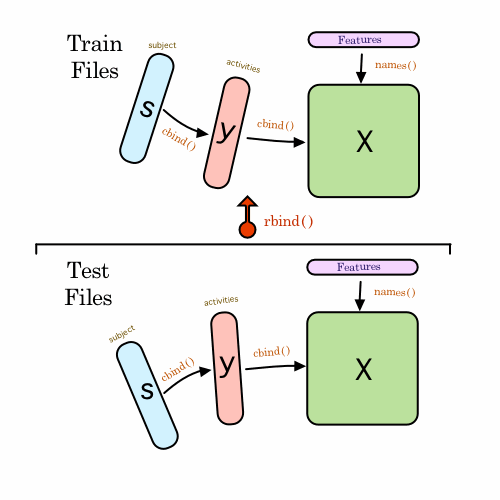

#Getting and Cleaning Data

##Course Project

This is the course project for the module Getting and Cleaning Data of the [Data Analysis Track](https://www.coursera.org/specializations/jhudatascience/1) from [Johns Hopkins University](https://www.jhu.edu/), hosted on [Coursera](https://www.coursera.org/).

##Overview

The purpose of this project is to demonstrate an ability to collect, work with, and clean a data set. The goal is to prepare tidy data that can be used for later analysis. 

One of the most exciting areas in all of data science right now is wearable computing - see for example the article [Data Science, Wearable Computing and the Battle for the Throne as World’s Top Sports Brand](http://www.insideactivitytracking.com/data-science-activity-tracking-and-the-battle-for-the-worlds-top-sports-brand/) . Companies like Fitbit, Nike, and Jawbone Up are racing to develop the most advanced algorithms to attract new users.

The project uses data from the Human Activity Recognition Using Smartphones Dataset Version 1.0. A full description is available at the site where the data was obtained: [http://archive.ics.uci.edu/ml/datasets/Human+Activity+Recognition+Using+Smartphones](http://archive.ics.uci.edu/ml/datasets/Human+Activity+Recognition+Using+Smartphones)

 A compressed file with all the data for the project was obtained from the course website [https://d396qusza40orc.cloudfront.net/getdata%2Fprojectfiles%2FUCI%20HAR%20Dataset.zip](https://d396qusza40orc.cloudfront.netgetdata%2Fprojectfiles%2FUCI%20HAR%20Dataset.zip)

##Project Files

####README.md

This file

####summary.txt

The summary data file created in step 12 of the R programming script `run_analysis.R`. This is a tidy data set with the average of each variable for each activity and each subject.

To load this file use `read.table("summary.txt", header = TRUE)` 

####CodeBook.md

This file contains the following:

1. Details of the Human Activity Recognition Using Smartphones Dataset
Version 1.0
2. Details of the downloaded data files from the experiment
3. Details of the observations that were recorded by the smartphone for every activity in the experiment
4. The look-up table for each acitivity
5. Preliminary set-up

####run_analysis.R

This is the R programming script for the course project.

There are 5 requirements for the script:

1. Merge the training and the test sets to create one data set.
2. Extract only the measurements on the mean and standard deviation for each measurement. 
3. Use descriptive activity names to name the activities in the data set
4. Appropriately label the data set with descriptive variable names. 
5. From the data set in step 4, create a second, independent tidy data set with the average of each variable for each activity and each subject.

**Note: this script can only be run as long as the Samsung data is in your working directory**

----

The script works as follows:

###Requirements 1 & 4 

1. Load the `dplyr` and `tidyr` packages. Functions from these packages will be used later in the script.
2. Read in the data files. These are divided into 2 distinct sets (see section 2 of [CodeBook.md](CodeBook.md)): training data and test data.
    + Each subset comes in 3 parts
        + the actual observations
        + the activity being undertaken
        + the participant for each activity
    + Each file in the subset is read into the script as a data frame.
        + _coding note_: it would have been more expedient to use the `fread()` function from the `data.table` package but this caused a _fatal_ error in RStudio which was not resolved _(mac OS X 10.7.5, RStudio 0.99.441 running R version 3.1.3.)_
    + The variables for the `y` and `s` files are appropriately labelled proir to merging
    + The 3 files are then each assembled into a temporay data frame using `cbind()`
3. Included within the data is a `features.txt` file which lists the type of experimental observation for each variable in the `X_` file from each subset. These are then used for the column names of the `X_` files.
    + The `features.txt` file is read in as a data frame but a vector of "names" for the variable labels is required. The script extracts the actual feature names from column 2 of the features data frame and uses `unlist()` to create the required vector. _This satisfies requirement 4 of the assignment; to label all the variables._  
4. The 2 subsets are than assembled into a larger data frame using `rbind()`
    + _to free up memory all the individual data frames created from reading-in and assembling the subsets are removed from the environment using `rm()`_
    + Below is a graphic representation of the assembly process:
    + 
5. The resulting data frame is then wrapped in a data frame table from the `dplyr` package to assist with the tidying proces.

###Requirement 2

6. A subset of the data frame is created by extracting only those variables that relate to mean or standard deviations.
    + Only the variables containing `mean()` are extracted. Variables with the suffix `Mean` or `meanFreq` are excluded as these are averages obtained from the existing data not observations (see section 3 of [CodeBook.md](CodeBook.md))).
    + _coding note_: as there are some duplicate variable names (a result of using the `features.txt` list) the `select{dplyr}` function returns an error. The script therefore uses a basic regular expression to return the indexes of the `names()` vector that match the pattern. This is then used to subset the data frame.
     
###Requirement 3

7. The supplied look-up table is used to convert the integer code for each activity into a character string of the actual activity.
    + the script creates a character vector of cross-referenced activities and then substitues this for the `activity` column in the dataframe.

###Requirement 5

The script uses the forward pipe operator `%>%` to chain the remaining steps together.

8. Create a "long file" by *'melting'* the data into a row for every observation. Uses the `gather()` function.
9. Create a new column of factors using `mutate()` to identify each observation as either "mean" or "standard deviation"
    + this is done using a regular expression pattern to determine whether the character string in the _sample_ column contains the word "mean".
10. Summarise the data for the average of each variable for each activity and each subject using `summarise()`.
    + the data is grouped by `subject` > `activity` > `statistical type`
11. *'Spread'* the data using `spread()` so that there are 2 variables *average_mean* and *average_standard_deviation* for each `subject` > `activity`
12. Create and save a new file, `summary.txt`, from the summarised data. This file can then be loaded back into R with `read.table("summary.txt", header = TRUE)`

-----------------

Use of the data is licensed from:

Davide Anguita, Alessandro Ghio, Luca Oneto, Xavier Parra and Jorge L. Reyes-Ortiz. Human Activity Recognition on Smartphones using a Multiclass Hardware-Friendly Support Vector Machine. International Workshop of Ambient Assisted Living (IWAAL 2012). Vitoria-Gasteiz, Spain. Dec 2012

This dataset is distributed AS-IS and no responsibility implied or explicit can be addressed to the authors or their institutions for its use or misuse. Any commercial use is prohibited.

Jorge L. Reyes-Ortiz, Alessandro Ghio, Luca Oneto, Davide Anguita. November 2012.
    
